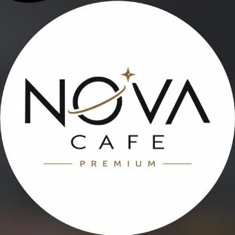

# ☕ NOVA CAFE PREMIUM — Mobil Uyumlu Masa & Adisyon Yönetim Sistemi

Modern, hızlı ve hem telefon hem bilgisayar uyumlu cafe adisyon ve masa yönetim web uygulaması.



## ✨ Özellikler

- **📱 %100 Mobil Uyumlu (Responsive & Touch-Friendly):** Garsonlar cep telefonundan (iOS / Android) kolayca sipariş girebilir. Alt navigasyon çubuğu, hızlı sepet önizleme ve dokunmatik butonlar.
- **🪑 Canlı Masalar:** Masaların doluluk durumu, sipariş sayısı, açık kalma süresi ve anlık tutarı canlı takip edilir.
- **☕🔥 Sıcak & 🧊 Soğuk Ayrımı:** Ürünler Sıcak İçecekler, Soğuk İçecekler ve Tatlı/Yiyecek olarak kategorize edilmiştir. Hesap pusulasında sıcak ve soğuk dökümleri ayrı ayrı listelenir.
- **🏷️ Menü & Fiyat Belirleme:** Ürün fiyatları tek tıkla liste üzerinden değiştirilebilir veya yeni ürün eklenebilir. Değişiklikler anında tüm masalara yansır.
- **🧾 Otomatik Hesaplama & Adisyon:** Güncel fiyatlar otomatik çekilir, indirim/ikram uygulanabilir, Nakit / Kart / Havale ödeme tipi seçilir ve şık fiş yazdırılabilir.
- **📊 Kasa & Ciro Takibi:** Günlük ciro, nakit ve kartlı ödeme toplamları anlık toplanır.
- **💾 Kalıcı Hafıza (LocalStorage):** Sayfa kapansa bile hiçbir masa veya sipariş kaybolmaz.

## 🚀 Hızlı Başlangıç

1. Projeyi klonlayın veya indirin:
   ```bash
   git clone https://github.com/<kullanici-adi>/nova-cafe-pos.git
   ```
2. `index.html` dosyasını herhangi bir web tarayıcısında (Chrome, Safari, Edge) açın. Ek bir sunucu kurulumu gerekmez!

## 🌐 GitHub Pages ile Canlıya Alma (Telefondan Açmak İçin)

1. Bu repoyu GitHub'da oluşturun ve dosyaları yükleyin.
2. Reponun **Settings > Pages** sekmesine gidin.
3. Branch olarak `main` veya `master` seçip **Save** butonuna tıklayın.
4. Birkaç saniye içinde `https://<kullanici-adi>.github.io/nova-cafe-pos` adresinden yayına girer ve tüm çalışanlar cep telefonundan adresi açıp kullanabilir!
